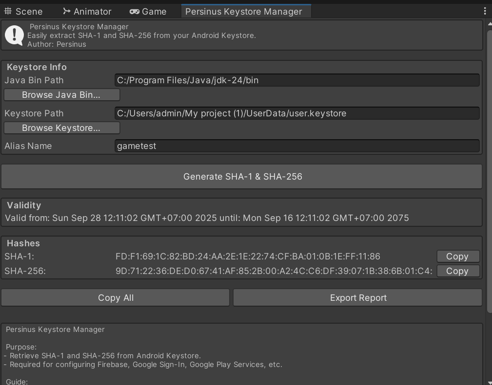

# 🎮 Unity Package - Persinus Keystore Manager  


  

A **Keystore Management Tool** for Unity.  
Easily check aliases, generate SHA1/SHA256 hashes, and quickly export for Android/iOS.  

---

## 🚀 Installation  

### 1. Via Unity Package Manager (UPM)  

1. Open **Unity** → **Window → Package Manager**  
2. Click **+** → **Add package from git URL…**  
3. Paste the following URL:  

```bash
https://github.com/Persinus/persinus-keystore-manager.git
```  


---


## ✨ Features  

- Manage and view **keystore** details directly inside Unity Editor  
- Display SHA1 / SHA256 / MD5 fingerprints  
- Support manual alias input  
- Warning for certificates using **SHA1** (deprecated / insecure)  

---

## 📋 Requirements  

- Unity **2021.3 LTS** or newer  
- .NET Standard 2.1  

---

## 📄 License  

MIT License © 2025 Persinus  
